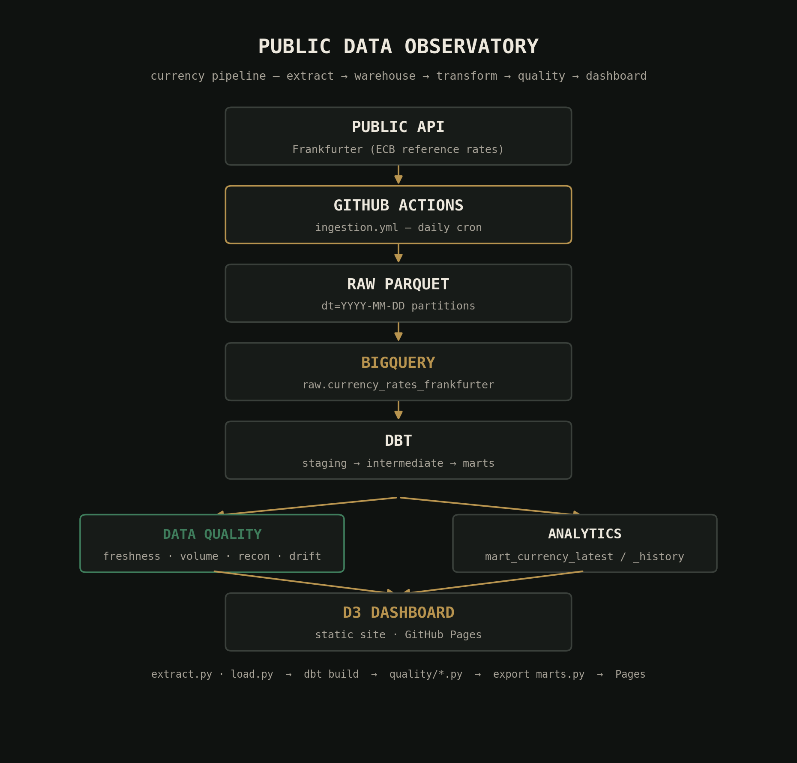

# Public Data Observatory

A daily pipeline that pulls ECB reference exchange rates from the
[Frankfurter API](https://frankfurter.dev), lands them in BigQuery,
transforms them with dbt, runs them through four independent data
quality checks, and publishes the result as a static D3 "fixing
board" dashboard. [Here](https://vmose.github.io/Frankfurter_ECB_Rating/)
is the resulting app build from the entire pipeline. 



```
Public API (Frankfurter) → GitHub Actions → Raw Parquet → BigQuery → dbt
                                                                        │
                                              ┌─────────────────────────┴────────────┐
                                              ↓                                      ↓
                                        Data Quality                            Analytics
                                              │                                      │
                                              └──────────────────┬───────────────────┘
                                                                  ↓
                                                            D3 Dashboard
```

## Repo structure

```
public-data-observatory/
├── .github/workflows/     ci.yml, ingestion.yml, dbt.yml, deploy.yml
├── ingestion/              extract.py, load.py, schema.py, export_marts.py
├── dbt/                    staging → intermediate → marts models, tests
├── quality/                freshness.py, volume.py, reconciliation.py, schema_drift.py
├── dashboard/               static D3 site (index.html, app.js, styles.css)
├── infrastructure/terraform/  BigQuery datasets + keyless GitHub Actions auth
├── tests/                   pytest suite (all mocked, no cloud creds needed)
├── scripts/                  one-off dev scripts (e.g. regenerating architecture.png)
├── Dockerfile
└── requirements.txt
```

## How it fits together

1. **`ingestion/extract.py`** — pulls rates from `GET /v2/rates`
   (explicitly filtered to `providers=ECB`, since the API blends
   across all providers by default) and writes
   `dt=YYYY-MM-DD/rates.parquet` partitions. The API returns a flat
   array of `{date, base, quote, rate}` rows, and *different
   currencies in the same response can carry different dates* —
   slower-publishing currencies routinely lag faster ones, not just
   on weekends. `extract.py` groups rows by their own true date and
   writes one partition per date found, so a single run can write
   more than one partition. Backfills use the `from`/`to` time-series
   query, chunked by calendar year, instead of one request per day.
2. **`ingestion/load.py`** — loads each partition into
   `raw.currency_rates_frankfurter` in BigQuery, using a partition
   decorator + `WRITE_TRUNCATE` so re-running a day is idempotent.
3. **`dbt/`** — `stg_currency_rates` (clean/typed) →
   `int_currency_rates_daily_change` (day-over-day deltas) →
   `mart_currency_latest` / `mart_currency_history` (dashboard-facing).
4. **`quality/`** — four independent checks, each exiting
   `0=pass 1=warn 2=fail 3=error`:
   - `freshness.py` — is the latest rate recent, accounting for
     weekends/holidays?
   - `volume.py` — is today's row count in line with the trailing
     median (catches partial loads)?
   - `reconciliation.py` — do our USD/EUR, USD/GBP, USD/JPY rates
     agree with a second independent API within tolerance?
   - `schema_drift.py` — has the live BigQuery schema drifted from
     what `ingestion/schema.py` expects?
5. **`ingestion/export_marts.py`** — the bridge from BigQuery to the
   static dashboard: writes `dashboard/data/{latest,history,quality}.json`.
6. **`dashboard/`** — a dependency-free static site (D3 loaded from a
   CDN) that reads those three JSON files. No BigQuery credentials
   ever touch the browser.

### Workflow chain

`ingestion.yml` (daily cron) → triggers `dbt.yml` on success → triggers
`deploy.yml` on success → publishes `dashboard/` to GitHub Pages.
`ci.yml` runs independently on every push/PR and needs no cloud
credentials (lint + unit tests only).

## Getting started

### 1. GCP infrastructure

```bash
cd infrastructure/terraform
cp terraform.tfvars.example terraform.tfvars   # fill in your project_id and github_repo
terraform init
terraform apply
```

This creates the `raw` / `staging` / `intermediate` / `marts` BigQuery
datasets, plus a service account GitHub Actions can assume via
Workload Identity Federation — **no downloadable JSON key is ever
created**.

Note the two outputs you'll need next:

```bash
terraform output github_actions_service_account_email
terraform output workload_identity_provider
```

### 2. GitHub repo configuration

Under **Settings → Secrets and variables → Actions → Variables**, add:

| Variable | Value |
|---|---|
| `GCP_PROJECT_ID` | your GCP project ID |
| `GCP_SERVICE_ACCOUNT` | the service account email from step 1 |
| `GCP_WORKLOAD_IDENTITY_PROVIDER` | the WIF provider resource name from step 1 |
| `BQ_LOCATION` | `US` (or your `bq_location` if you changed it) |

Under **Settings → Pages**, set the source to **GitHub Actions**
(this is what `deploy.yml`'s `actions/deploy-pages` step publishes to).

### 3. Run it

You can wait for the daily cron (17:00 UTC), or trigger it by hand
from the **Actions** tab: run **Ingestion** with `workflow_dispatch`,
which will cascade into **dbt** and **Deploy Dashboard** automatically.

For a first backfill (so the dashboard isn't a single dot), run
**Ingestion** manually with `mode: backfill` and a `start`/`end` date
range — with `providers=ECB`, rates go back to 1999-01-04 (when the
euro launched); other providers in Frankfurter's blended data go back
further, but we deliberately don't use those (see below). Backfills
are fetched one calendar year at a time (not one request per day), so
even a multi-decade range is a manageable number of API calls.

## Running locally

```bash
python -m venv .venv && source .venv/bin/activate
pip install -r requirements.txt

gcloud auth application-default login   # sets up local ADC

# Ingestion
python ingestion/extract.py --mode latest
python ingestion/load.py --project YOUR_PROJECT_ID --all

# dbt
export GCP_PROJECT_ID=YOUR_PROJECT_ID
cd dbt && dbt deps && dbt build && cd ..

# Quality checks
python quality/freshness.py --project YOUR_PROJECT_ID
python quality/volume.py --project YOUR_PROJECT_ID
python quality/reconciliation.py --project YOUR_PROJECT_ID
python quality/schema_drift.py --project YOUR_PROJECT_ID

# Export + preview dashboard
python ingestion/export_marts.py --project YOUR_PROJECT_ID --out-dir dashboard/data
cd dashboard && python -m http.server 8000   # open http://localhost:8000
```

## Testing & linting

```bash
pytest tests/ -v          # 34 tests, all mocked — no cloud creds needed
ruff check .               # lint
ruff format --check .      # format check
```

`tests/test_transformations.py` is worth a read before you touch the
dbt SQL: it re-implements the day-over-day change logic in pandas as
an executable spec, since the actual SQL can only be validated against
a real warehouse (that happens via `dbt build` + the schema/singular
tests in `dbt/`).

## Extending

- **Add a second data source** (e.g. CoinGecko crypto prices): mirror
  `ingestion/extract.py` + `schema.py` for the new source, give it its
  own raw table, and add a `source_name` branch in the staging layer.
  `reconciliation.py`'s pattern (compare against a second API) extends
  naturally to cross-checking two *primary* sources against each other.
- **Widen the currency list**: edit `DEFAULT_QUOTES` in
  `ingestion/extract.py`. No schema changes needed — `quote_currency`
  is just a string column.
- **Tighten/loosen quality thresholds**: each check's tolerance is a
  module-level constant near the top of its file (`WARN_AFTER_DAYS`,
  `DEVIATION_TOLERANCE`, `TOLERANCE_PCT`, etc.) — no need to hunt
  through logic to adjust them.

## Data source

Rates are ECB reference rates via the free, keyless
[Frankfurter API](https://frankfurter.dev)'s `/v2/rates` endpoint,
explicitly filtered with `providers=ECB` — by default Frankfurter
blends rates across all 84+ contributing central banks, which is not
what this pipeline wants. ECB rates publish once daily (~16:00 CET)
and not on weekends or EU bank holidays. Even within a single "latest"
response, different currencies can carry different dates (real
publish lag, not just weekends) — `extract.py` preserves each row's
own true date rather than assuming one date per pull.
